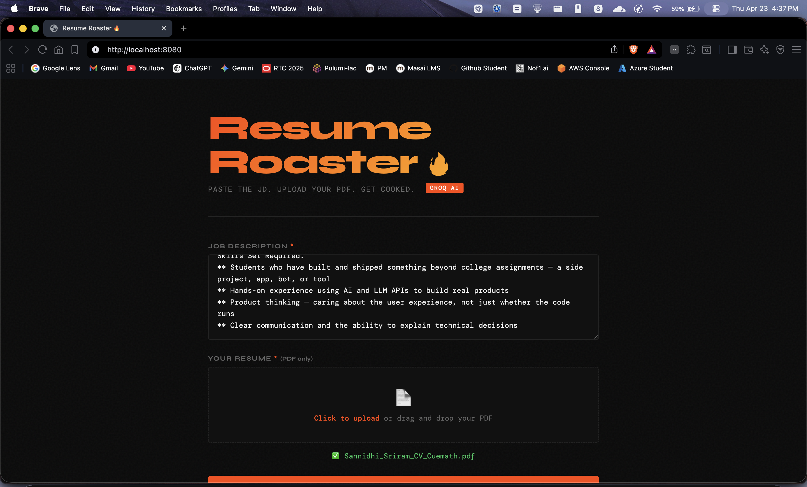

# Resume Roaster 🔥

A containerized Go HTTP service that roasts your resume against a job description using Groq's LLaMA model. Upload your PDF, paste the JD, get brutally honest feedback.

## Stack

- **Go** — HTTP server (stdlib only, no frameworks)
- **Groq API** — LLaMA 3.1 8B for the AI roasting
- **poppler-utils** — PDF text extraction via `pdftotext`
- **Docker** — Multi-stage build (Go builder → Debian slim runtime)

## Endpoints

| Method | Path | Description |
|--------|------|-------------|
| GET | `/` | Web UI |
| GET | `/health` | Health check |
| POST | `/roast` | Upload resume PDF + JD, get roasted |

## Project Structure

```
resume-roaster/
├── main.go              # Go HTTP server
├── static/
│   └── index.html       # Web UI
├── Dockerfile           # Multi-stage build
├── docker-compose.yml
├── .env.example
└── README.md
```

## Setup & Running

### Prerequisites
- Docker Desktop installed
- Groq API key from [console.groq.com](https://console.groq.com)

### With Docker Compose (recommended)

```bash
# 1. Clone the repo
git clone https://github.com/SannidhiSriram-06/Resume_Roast_Docker.git
cd Resume_Roast_Docker

# 2. Set your Groq API key
cp .env.example .env
# Edit .env → GROQ_API_KEY=your_key_here

# 3. Build and run
docker compose up --build

# 4. Open http://localhost:8080
```

### API Usage (curl)

```bash
curl -X POST http://localhost:8080/roast \
  -F "resume=@/path/to/resume.pdf" \
  -F "jd=We are looking for a DevOps engineer with 3+ years experience..."
```

---

## Screenshots

### Web UI


### Project Setup & Go Installation


### Docker Image Build


### Git Commits & Source Repository


### Running Container (docker compose up)

